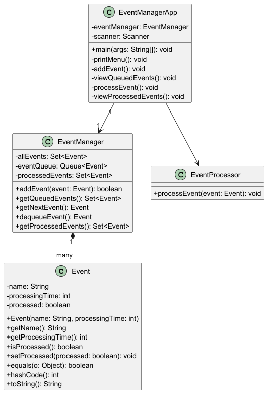
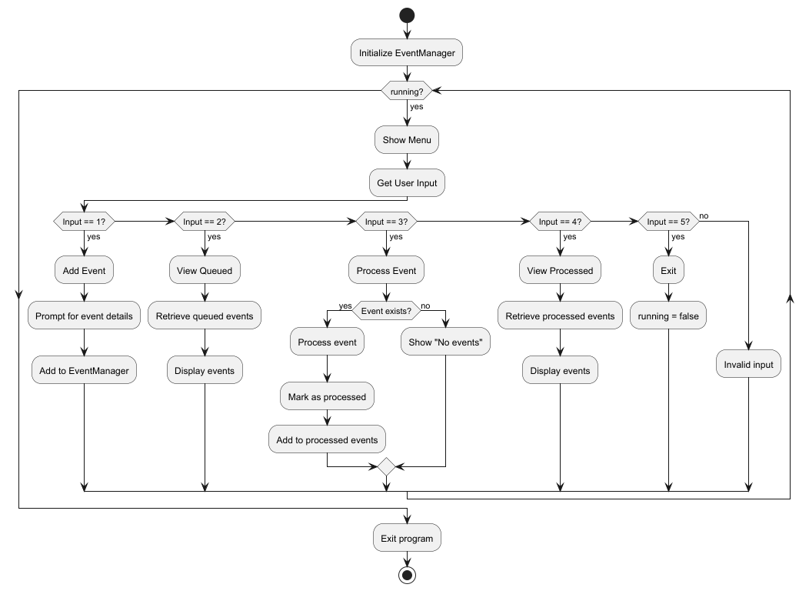

# Event Management System

A Java-based event management system that processes client requests as unique events using Set and Queue data structures.

## Features
- Add new events with unique names
- View queued events waiting for processing
- Process events in FIFO order
- View processed events
- Prevent duplicate events

## Technologies
- Java JDK 24
- Maven 3.9.6
- JUnit 5

#### Project Structure
```
event-manager/
├── src/
│   ├── main/
│   │   ├── java/
│   │   │   └── university/
│   │   │       └── jala/
│   │   │           └── eventmanager/
│   │   │               ├── Event.java
│   │   │               ├── EventManager.java
│   │   │               ├── EventManagerApp.java
│   │   │               └── EventProcessor.java
│   │   └── resources/
│   └── test/
│       └── java/
│           └── university/
│               └── jala/
│                   └── eventmanager/
│                       └── EventManagerTest.java
├── docs/
│   ├── class_diagram.puml
│   └── flow_diagram.puml
├── LICENSE
├── pom.xml
└── README.md
```

## Class Diagram


## Flow Diagram


## Building and Running
1. Clone the repository:
```bash
git clone https://github.com/yourusername/event-manager.git
cd event-manager
```

2. Build with Maven:
```bash
mvn clean package
```

3. Run the application:
```bash
java -jar target/event-manager-1.0.0.jar
```

## Running Tests
```bash
mvn test
```

## Usage
1. **Add Event**:
    - Enter event name and processing time
    - Duplicates are automatically rejected

2. **View Queued Events**:
    - Shows all events waiting for processing

3. **Process Event**:
    - Processes the next event in the queue
    - Simulates processing time
    - Moves event to processed set

4. **View Processed Events**:
    - Shows all completed events

5. **Exit**:
    - Terminates the application

## Test Cases
| Test Case ID | Description | Expected Result |
|--------------|-------------|-----------------|
| TC-01 | Add new unique event | Event added successfully |
| TC-02 | Add duplicate event | Event rejected |
| TC-03 | View empty queue | "No queued events" message |
| TC-04 | Process with empty queue | "No events to process" message |
| TC-05 | Process single event | Event moved to processed set |
| TC-06 | View empty processed events | "No processed events" message |
| TC-07 | Multiple event processing | Events processed in FIFO order |

## License
This project is licensed under the MIT License - see the [LICENSE](LICENSE) file for details.